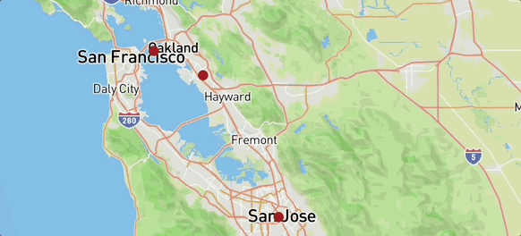

# Place ive visteded in the bay

## What did I build?

what i built is places i went to and im try to go for some quiet photos

Here's a demo:

## Tech stack

To build this app, I used the following tools:

1. [Google  Maps](https://www.google.com/maps/d/u/0/).
2. [Mapbox GL JS](https://docs.mapbox.com/mapbox-gl-js/guides) library, for styling and displaying maps and route lines, and adding camera behaviors (flyto animations).
3. [Visual Studio Code](https://code.visualstudio.com/download) free IDE, with [Live Server](https://marketplace.visualstudio.com/items?itemName=ritwickdey.LiveServer) and [Markdown All in One](https://marketplace.visualstudio.com/items?itemName=yzhang.markdown-all-in-one) extensions.
4. [GitHub pages](https://docs.github.com/en/pages/getting-started-with-github-pages/creating-a-github-pages-site), for publishing the app for free!

## Spotlight

What i want people to notice from my first map is they can go to these type of place themselfs and get other places in the bay they can go to.
